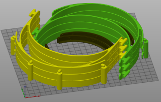
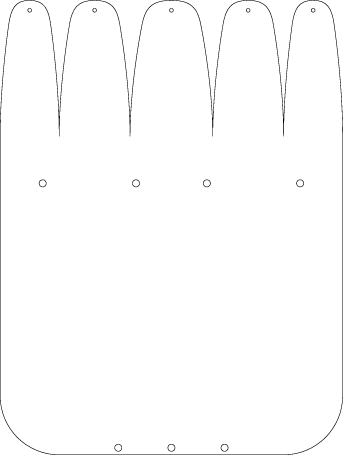

MakerNexus local modifications
------------------------------

At [MakerNexus], we're working on
[making as many face-shields as possible][covidshieldnexus] as possible;
They will be in dire demand very soon and we got requests of thousands of them.
MakerNexus is coordinating the contact with the local hospitals and
as well the effort of non-Members of the maker-space to 3D print. We
have enough shield material to laser-cut, but of course 3D printing is the
slow part of manufacturing.

Please check out the [project page] if you are in the San Francisco
Bay Area and want to help.

We are using the [Prusa-rc3] design, but needed some modifications requested
by the local healthcare community.

### Design goals

When reviewing, the local healthcare providers requested

   * Weight-reduce front-part if possible.
   * Move the shield pins up so that there is material behind the openings
     of the shield-punches
   * Larger radius of crevices to allow better sterilization access.

Moving up the shield-pin requires a little bit of support material, but it
is not a problem to generate the necessary STL file where the supports should
be and use that in the Prusa slicer as support modifier.

### Download

Choose what bests fits your circumstances. GCode is 'ready to go', 3mf allows
printer adjustments, *.stl allows to use in your own slicer.

You can just use the files below directly. If you want to work on the repo,
pull requests are welcome, but please discuss things first on slack.

### Release content

We are only printing the 'thin' shield version now (15mm vs. 20mm before).


#### Cut to the chase: GCode ready to use

Recommended

  * For **PETG** [T9-PETG-Prusa.gcode](https://github.com/makernexus/prusa-covid19-shield-remix/raw/v1.9/fab/T9-PETG-Prusa.gcode) (right click, download or *save link as...*) GCode file placing 2 head-bands on build-plate. Ready to go on Prusa MK3(s) with 0.3mm layer, 100% infill, 240°C temp for PETG printing. This prints two thin bands which is faster to print and works fine with PETG.

  * For **PLA** [T9-PLA-Prusa.gcode](https://github.com/makernexus/prusa-covid19-shield-remix/raw/v1.9/fab/T9-PLA-Prusa.gcode) (right click, download or *save link as...*) Same for PLA. Currently this is the regular sized band as we still need to test if the thinner band will work with PLA.

The resulting headband has a version imprint on one temple with a letter
denoting `T` = thin band, and `s` = stacked, followed a version number.


#### More files

 * [thin_shield_with_support.stl](https://github.com/makernexus/prusa-covid19-shield-remix/raw/v1.9/fab/thin_shield_with_support.stl) and
   [thin_shield_no_support.stl](https://github.com/makernexus/prusa-covid19-shield-remix/raw/v1.9/fab/thin_shield_no_support.stl). The *with_support* version has already a support column included
   for printing the pin. Make sure you have **thin wall detection** enabled in
   your slicer. If you choose the *no support* version, you need
   to use your slicer to create support for the mounting pins.


If you have checked out code from github, you might need to first `make` it
and reload the STLs in the 3mf. The STLs and 3mf are usually only updated in
git for a new release (click on the stl in the list on the right in prusa slicer
and say 'reload from disk').

#### Stacked arrangement
There are 3mf's for stacks and makefile-rules to create various height stack
arrangements. The 3mf's with 'FAST' in their name are tweaked for very fast
prints, but it requires some tweaking depending on your filament to get the
flow-rate right and the separability correct. For details about the speed
improvements see the [Fast-Stacks](./Fast-Stacks.txt) documentation.



The way these stacks work is that they have a one-layer gap between them, with
the intent to have a weak layer adhesion there to be able to separate, but
still strong enough to print the next layers. This is the reason why it also
requires some tweaking which is very dependent on the printer and filament you
have, so we don't distribute any GCode. The gap height is 0.25mm, so this is
the layer thickness needed in your slicer (or modify the `print_layer_height`
in the Makefile).

If you use a different slicer than Prusa slicer, you can also create STLs for
the stacks and slice these.

```shell
make fab/thin-stack3.stl
```

### Faceshield

The face-shield has been optimized at MakerNexus to meet the needs of the
healthcare workers to be also protected above the headband. You find the
[maker-nexus-faceshield-cut.svg file](./baseline/maker-nexus-faceshield-cut.svg)
and [maker-nexus-faceshield-cut.dxf](./baseline/maker-nexus-faceshield-cut.dxf)
in the [baseline/](./baseline) subdirectory



### Code

A simple OpenSCAD file that take the original STL and does the necessary
surgical changes.

### Slicer project file
A 3mf file is provided, so it can be loaded into slicer right away:

```
git clone https://github.com/hzeller/prusa-covid19-shield-remix.git
cd prusa-covid19-shield-remix
prusa-slicer thin_shield.3mf
```

### Replication Script

A script is provided that will take an existing Prusa Slicer project file (.3mf) with a single model already imported and fill the bed with as many of that model that will fit.  The script must be run with the python3 interpreter:

```
python3 scripts/replicate_model.py --help
usage: replicate_model.py [-h] [-w BED_WIDTH] [-d BED_DEPTH] -m MODEL -o
                          OUTPUT [--x_offset X_OFFSET] [--y_offset Y_OFFSET]
                          [--left_offset LEFT_OFFSET]
                          [--right_offset RIGHT_OFFSET]
                          [--front_offset FRONT_OFFSET]
                          [--rear_offset REAR_OFFSET] [-x X_SPACING]
                          [-X X_GAP] [-y Y_SPACING] [-Y Y_GAP]

optional arguments:
  -h, --help            show this help message and exit
  -w BED_WIDTH, --bed_width BED_WIDTH
                        Width of the print bed in mm (default: 250)
  -d BED_DEPTH, --bed_depth BED_DEPTH
                        Depth of the print bed in mm (default: 210)

required options:
  -m MODEL, --model MODEL
                        Baseline .3mf model file with one instance of the
                        model to be duplicated
  -o OUTPUT, --output OUTPUT
                        Output .3mf model file with one instance of the model
                        to be duplicated

keepout options:
  --x_offset X_OFFSET   X-axis offset from left and right edges of the bed
  --y_offset Y_OFFSET   Y-axis offset from front and rear edges of the bed
  --left_offset LEFT_OFFSET
                        Offset from the left side of the bed (x-axis, left
                        side only)
  --right_offset RIGHT_OFFSET
                        Offset from the right side of the bed (x-axis, right
                        side only)
  --front_offset FRONT_OFFSET
                        Offset from the front of the bed (y-axis, front only)
  --rear_offset REAR_OFFSET
                        Offset from the back of bed (y-axis, back only)

layout options:
  -x X_SPACING, --x_spacing X_SPACING
                        X-axis spacing in mm from the start of one instance of
                        the model to the next. This allows the models to
                        overlap in the X-axis.
  -X X_GAP, --x_gap X_GAP
                        X-axis gap from the edge of one model to the next
  -y Y_SPACING, --y_spacing Y_SPACING
                        Y-axis spacing in mm from the start of one instance of
                        the model to the next. This allows the models to
                        overlap in the Y-axis.
  -Y Y_GAP, --y_gap Y_GAP
                        Y-axis gap from the edge of one model to the next
```

There are only two required options (-m <source model> and -o <output model>).  The rest control the location on the bed / keepout areas where the objects can be laid out and then control the replication process itself.

All measurements are specified in mm and can be decimal values (e.g. 5.4).

The objects will be laid out in a grid pattern in rows and columns.  For the layout options, there are two ways the layout will be performed.  If the spacing options is specified, the object will be replicated at the given interval (e.g. every 10mm in the specified axis).  This allows each model to overlap the previous one.  If spacing is not provided, then the gap value will be used and the objects will have the specified gap between them.

With the specified bed dimensions, keepout area and layout options, the script will fit as many of the object as possible in the allowed area.

For the bottom support with the open curve facing downwards, it is desirable to have a gap in the X-axis, but to provide a spacing for the Y-axis.  The Makefile uses the following options to produce a dense, printable layout for the Prusa i3 mk3:

```
python3 scripts/replicate_model.py \
--model baseline/bottom_reinforcement-single-fast.3mf \
--output fab/bottom_reinforcement-full_plate-fast.3mf \
--x_offset 4 --front_offset 10 --x_gap 1 --y_spacing 8.2
```

With those options, the project file 'baseline/bottom\_reinforcement-single-fast.3ml' will be read and the first model replicated per the keepout/layout options.  It will then be written into the output project file 'fab/bottom\_reinforcement-full\_plate-fast.3mf'.

The default bed size (250 x 210) will be used with 4mm of space on the left and right side and 10mm of space on the bottom and 5mm on top.  (I have added more space to the bottom for the mk3 as the bottom corners aren't heated as well and the model may warp and get knocked off of the bed in those locations).  When laying out the replicated model, it will keep a 1mm gap between the columns and lay out the model vertically every 8.2mm.  That leaves enough gap between each so that the separate instances don't join together when printed.

This is what the output looks like:

```
python3 scripts/replicate_model.py --model baseline/bottom_reinforcement-single-fast.3mf --output fab/bottom_reinforcement-full_plate-fast.3mf --x_offset 4 --front_offset 10 --rear_offset 5 --x_gap 1 --y_spacing 8.2
replicate_model: Bed dimensions: [250 x 210]
replicate_model: Bed keep-out:
replicate_model:                 Rear: 5.0
replicate_model:           -----------------------
replicate_model:           |                     |
replicate_model: Left: 4.0 |                     | Right: 4.0
replicate_model:           |                     |
replicate_model:           -----------------------
replicate_model:                 Front: 10.0
replicate_model:
replicate_model: Processing project file (.3mf): baseline/bottom_reinforcement-single-fast.3mf
replicate_model: Model dimensions: [120.0572968 x 30.5739136]
replicate_model: Printing 42 objects [2 x 21]
replicate_model: Output project file (.3mf): fab/bottom_reinforcement-full_plate-fast.3mf
replicate_model: Complete.
```


### GCode
There is also gcode directly sliced for Prusa MK3(s). See above.

### Development

For building, use the Makefile to create all the artifacts from the *.scad
file

```
make
```

### License

License: [CC-BY-NC]

This is based on the Prusa design
https://www.prusaprinters.org/prints/25857-prusa-protective-face-shield-rc2

[MakerNexus]: https://www.makernexus.com/
[covidshieldnexus]: https://www.covidshieldnexus.org/
[prusa-rc3]: https://www.prusaprinters.org/prints/25857-prusa-protective-face-shield-rc3
[CC-BY-NC]: https://creativecommons.org/licenses/by-nc/4.0/
[project page]: http://makernexuswiki.com/index.php?title=3D_printed_face_shields
[prusa-slicer]: https://www.prusa3d.com/prusaslicer/
