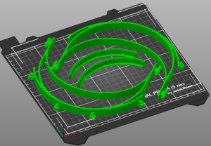

MakerNexus local modifications
------------------------------

At [MakerNexus], we're working on making as many face-shields as possible;
They will be in dire demand very soon and we got requests of thousands of them.
MakerNexus is coordinating the contact with the local hospitals and
as well the effort of non-Members of the maker-space to 3D print. We
have enough shield material to laser-cut, but of course 3D printing is the
slow part of manufacturing.

Please check out the [project page] if you are in the San Francisco
Bay Area and want to help.

We are using the [Prusa-rc3] design, but needed some modifications requested
by the local healthcare community.

### Design goals

When reviewing, the local healthcare providers requested

   * Weight-reduce front-part if possible.
   * Move the shield pins up so that there is material behind the openings
     of the shield-punches

Moving up the shield-pin requires a little bit of support material, but it
is not a problem to generate the necessary STL file where the supports should
be and use that in the Prusa slicer as support modifier.

### Download

Choose what bests fits your circumstances. GCode is 'ready to go', 3mf allows
printer adjustments, *.stl allows to use in your own slicer.

Simply get the [latest release](https://github.com/hzeller/prusa-covid19-shield-remix/releases).

#### Release content

We distinguish between 'normal shield' and 'thin shield': the thinner one
only prints 15mm high (vs the normal 20mm).

#### Cut to the chase: GCode ready to use

Recommended

  * For PETG [thin_shield_0.3mm_PETG_MK3S.gcode](https://github.com/hzeller/prusa-covid19-shield-remix/raw/v1.4/fab/thin_shield_0.3mm_PETG_MK3S.gcode) (right click, download or *save link as...*) GCode file placing 2 head-bands on build-plate. Ready to go on Prusa MK3(s) with 0.3mm layer, 100% infill, 240°C temp for PETG printing. This prints two thin bands which is faster to print and works fine with PETG.

  * For PLA: [normal_shield_0.3mm_PLA_MK3S.gcode](https://github.com/hzeller/prusa-covid19-shield-remix/raw/v1.4/fab/normal_shield_0.3mm_PLA_MK3S.gcode) (right click, download or *save link as...*) Same for PLA. Currently this is the regular sized band as we still need to test if the thinner band will work with PLA.

#### More files



 * [normal_shield.3mf](https://github.com/hzeller/prusa-covid19-shield-remix/raw/v1.4/normal_shield.3mf) and [thin_shield.3mf](https://github.com/hzeller/prusa-covid19-shield-remix/raw/v1.4/thin_shield.3mf) for direct use in prusa-slicer
   (or other slicers that understand 3mf files).
 * [normal_shield_with_support.stl](https://github.com/hzeller/prusa-covid19-shield-remix/raw/v1.4/fab/normal_shield_with_support.stl) and
   [normal_shield_no_support.stl](https://github.com/hzeller/prusa-covid19-shield-remix/raw/v1.4/fab/normal_shield_no_support.stl)
   The *with_support* version has already a support column included
   for printing the pin. Make sure you have **thin wall detection** enabled in
   your slicer. If you choose the *no support* version, you need
   to use your slicer to create support for the mounting pins.
 * [thin_shield_with_support.stl](https://github.com/hzeller/prusa-covid19-shield-remix/raw/v1.4/fab/thin_shield_with_support.stl) and
   [thin_shield_no_support.stl](https://github.com/hzeller/prusa-covid19-shield-remix/raw/v1.4/fab/thin_shield_no_support.stl) : same, for thin shield.

If you have checked out code from github, you might need to first `make` it
and reload the STLs in the 3mf. The STLs and 3mf are usually only updated in
git for a new release (click on the stl in the list on the right in prusa slicer
and say 'reload from disk').

### Code

A simple OpenSCAD file that take the original STL and does the necessary
surgical changes.

### Slicer project file
A 3mf file is provided, so it can be loaded into slicer right away:

```
git clone https://github.com/hzeller/prusa-covid19-shield-remix.git
cd prusa-covid19-shield-remix
prusa-slicer normal_shield.3mf
```

### GCode
There is also gcode directly sliced for Prusa MK3(s). See above.

### Development

For building, use the Makefile to create all the artifacts from the *.scad
file

```
make
```

### License

License: [CC-BY-NC]

This is based on the Prusa design
https://www.prusaprinters.org/prints/25857-prusa-protective-face-shield-rc2

[MakerNexus]: https://www.makernexus.com/
[prusa-rc3]: https://www.prusaprinters.org/prints/25857-prusa-protective-face-shield-rc3
[CC-BY-NC]: https://creativecommons.org/licenses/by-nc/4.0/
[project page]: http://makernexuswiki.com/index.php?title=3D_printed_face_shields
[prusa-slicer]: https://www.prusa3d.com/prusaslicer/
